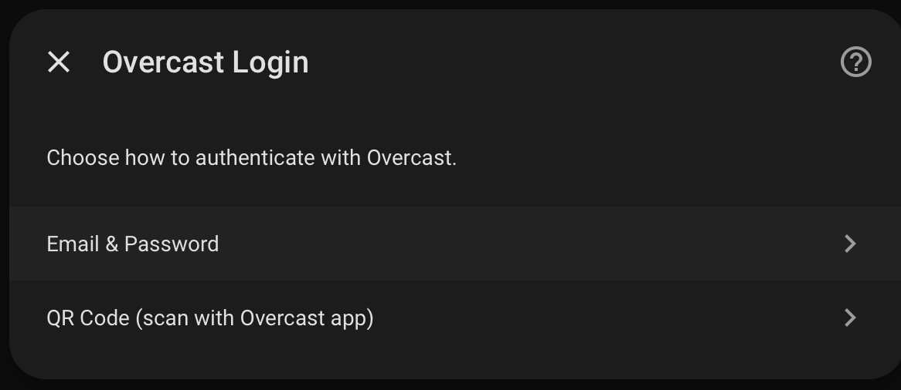
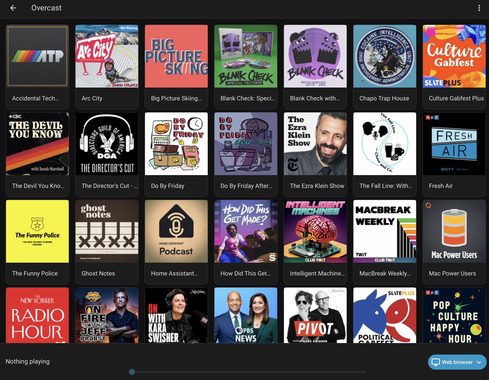
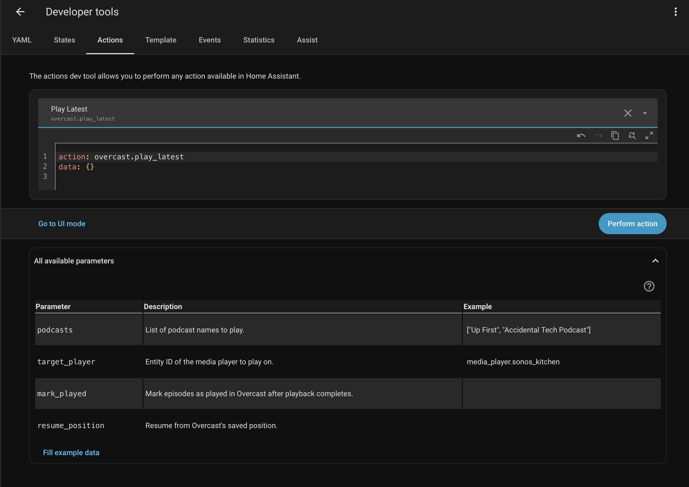

# Overcast for Home Assistant

[](https://hacs.xyz/)
[](https://www.home-assistant.io/)

<p align="center">
  
</p>

A Home Assistant custom integration that bridges [Overcast](https://overcast.fm) — the popular iOS podcast app — to HA's media ecosystem. Browse your subscriptions, play episodes on any speaker, and sync progress back to your phone automatically.

## Features

- **Media Browser** — Browse your Overcast subscriptions and episodes directly in Home Assistant
- **Play on Any Speaker** — Send podcast audio to Sonos, Chromecast, or any `media_player` entity
- **Two-Way Progress Sync** — Listening on your speaker updates Overcast on your phone
- **Auto Mark Played** — Episodes are marked as played in Overcast when playback completes
- **Speed Sync** — Respects per-podcast speed settings; optionally override in automations
- **Automation Ready** — `overcast.play_latest` service for hands-free morning routines

## Screenshots

| Setup | Media Browser | Services |
|:-----:|:------------:|:--------:|
|  |  |  |

## Installation

### HACS (Recommended)

1. Open HACS in Home Assistant
2. Click the three-dot menu → **Custom repositories**
3. Add `https://github.com/nickpdawson/OvercastAssistant` as an **Integration**
4. Search for "Overcast" and install
5. Restart Home Assistant

### Manual

1. Copy the `custom_components/overcast` folder to your HA `config/custom_components/` directory
2. Restart Home Assistant

## Setup

1. Go to **Settings → Devices & Services → Add Integration**
2. Search for **Overcast**
3. Choose your authentication method:
   - **Email & Password** — Enter your Overcast account credentials
   - **QR Code** — Scan the displayed code with the Overcast iOS app (no password sent to HA)
4. Your subscriptions will appear in the Media Browser

## Usage

### Media Browser

Open the **Media Browser** in Home Assistant and select **Overcast**. You'll see all your subscribed podcasts with artwork. Click a podcast to see its episodes, then click an episode to play it on any media player.

### Automation Example

Play the latest unplayed episodes of your favorite podcasts every morning:

```yaml
automation:
  - alias: "Morning Podcasts"
    trigger:
      - platform: time
        at: "07:00:00"
    condition:
      - condition: state
        entity_id: binary_sensor.someone_home
        state: "on"
    action:
      - service: media_player.volume_set
        target:
          entity_id: media_player.sonos_kitchen
        data:
          volume_level: 0.35
      - service: overcast.play_latest
        data:
          podcasts:
            - "Up First"
            - "Accidental Tech Podcast"
          target_player: media_player.sonos_kitchen
          mark_played: true
          resume_position: true
```

### Services

#### `overcast.play_latest`

Play the latest unplayed episode(s) of named podcasts on a media player.

| Parameter | Required | Default | Description |
|-----------|----------|---------|-------------|
| `podcasts` | Yes | — | List of podcast names to play |
| `target_player` | Yes | — | Entity ID of the media player |
| `mark_played` | No | `true` | Mark episodes as played in Overcast after playback |
| `resume_position` | No | `true` | Resume from Overcast's saved position |
| `speed` | No | — | Speed to sync to Overcast (0.75, 1.0, 1.25, 1.5, 1.75, 2.0, 2.25) |

> **Note:** The `speed` parameter controls what speed is reported back to Overcast — it does not change the actual playback speed on the media player (HA's `media_player` platform has no speed API).

#### `overcast.mark_played`

Mark an episode as played in Overcast without playing it.

| Parameter | Required | Description |
|-----------|----------|-------------|
| `episode_url` | Yes | Overcast episode URL (e.g. `https://overcast.fm/+XXXXX`) |

#### `overcast.refresh`

Force an immediate refresh of subscription and episode data.

## How It Works

There is no official Overcast API. This integration scrapes the Overcast web interface and uses the same XHR endpoints as the web player:

1. **Authentication** — Cookie-based session auth via email/password or QR code login
2. **Subscriptions & Episodes** — Parsed from server-rendered HTML at `overcast.fm/podcasts`
3. **Audio Playback** — Episode audio URLs point to the podcast's own CDN (Megaphone, Podtrac, etc.) with `Access-Control-Allow-Origin: *` — any media player can fetch them directly, no proxying needed
4. **Progress Sync** — Every 30 seconds, the integration reads the media player's position and POSTs it to Overcast's `set_progress` endpoint
5. **Mark Played** — When playback completes, the finished sentinel (`p=2147483647`) is sent to mark the episode as played

```
┌──────────────┐     scrape/POST      ┌──────────────┐
│  Home        │ ──────────────────── │  overcast.fm │
│  Assistant   │   (cookie auth)      │  (web app)   │
│              │                       └──────────────┘
│  overcast    │
│  integration │── media_source ──▶ HA Media Browser
│              │
│              │── play_media ──────▶ Sonos / any media_player
│              │   (direct CDN URL)
│              │
│              │── progress sync ──▶ POST /podcasts/set_progress/
│              │   (poll player position)
└──────────────┘
```

## Known Limitations

- **No playback speed control** — HA's `media_player` has no speed API. Speed is synced to Overcast only.
- **Session expiry** — Overcast cookies can expire without warning. You'll get a persistent notification to re-authenticate.
- **Signed audio URLs** — Some private/Patreon feeds use time-limited URLs. Episodes should be played soon after browsing.
- **HTML scraping** — Overcast can change its web interface at any time. If the integration breaks after an Overcast update, please [open an issue](https://github.com/nickpdawson/OvercastAssistant/issues).

## License

MIT
